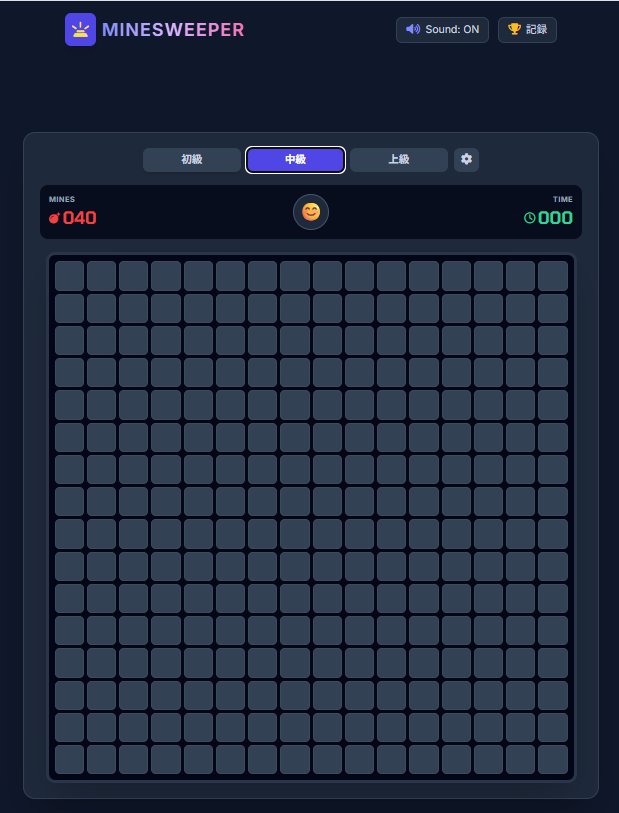

# 💣 Modern Minesweeper (マインスイーパー)

モダンで高機能なブラウザ版マインスイーパーです。PC・スマートフォンの両方で快適に遊べます。

🎮 **[ゲームをプレイする（GitHub Pages）](https://furuchai.github.io/minesweeper/)**

---

---

## ✨ 特徴

- **最初の1打目安全保証**: 初回クリックで絶対に地雷を踏まない安心設計
- **レスポンシブ UI**: スマホ・タブレット・PCどんな画面サイズでも自動フィッティング
- **充実の難易度**:
  - **初級** (9 × 9 / 地雷 10個)
  - **中級** (16 × 16 / 地雷 40個)
  - **上級** (30 × 16 / 地雷 99個)
  - **カスタム** (盤面サイズ・地雷数を自由に設定可能)
- **快適な操作性**:
  - **PC**: 右クリックで旗設置、両ボタン同時押しで隣接マス自動オープン
  - **スマホ**: 掘る/旗モード切替ボタン ＆ マス長押し（0.4秒）で旗設置
- **リアルな効果音**: Web Audio API (Tone.js) による開く音・爆発音・クリアファンファーレ
- **ベストタイム記録**: 難易度ごとにローカルストレージへハイスコアを保存

---

## 🛠️ 技術スタック

- **HTML5 / CSS3** (Tailwind CSS CDN)
- **JavaScript** (Vanilla JS)
- **Sound Engine**: Tone.js
- **Icons**: Lucide Icons
- **Font**: Inter / JetBrains Mono

---

## 📱 スマホでアプリのように遊ぶ方法

1. [公開URL](https://furuchai.github.io/minesweeper/) をスマホのブラウザ（Safari / Chrome）で開きます。
2. 共有メニューから **「ホーム画面に追加」** を選択します。
3. ホーム画面に作成されたアイコンからいつでもワンタップで起動できます。
